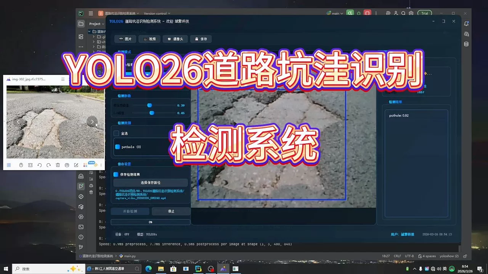
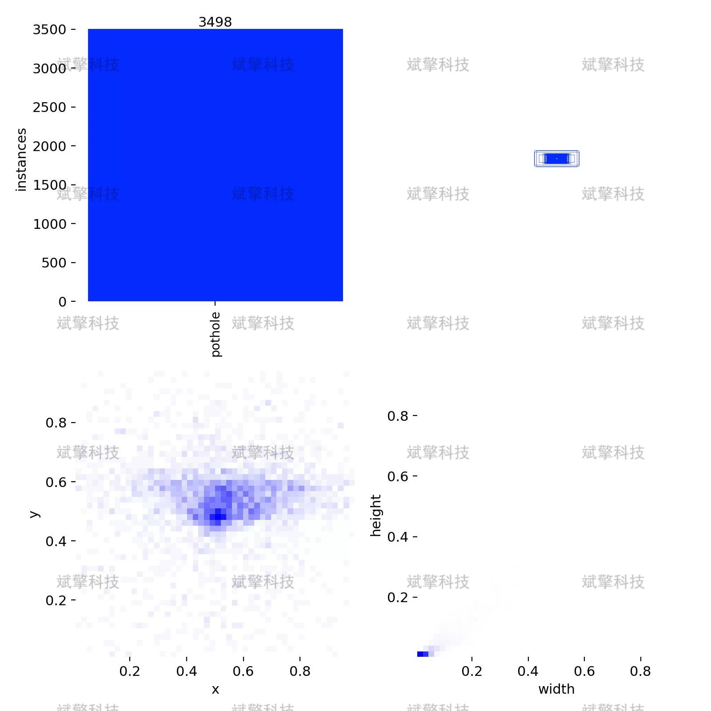
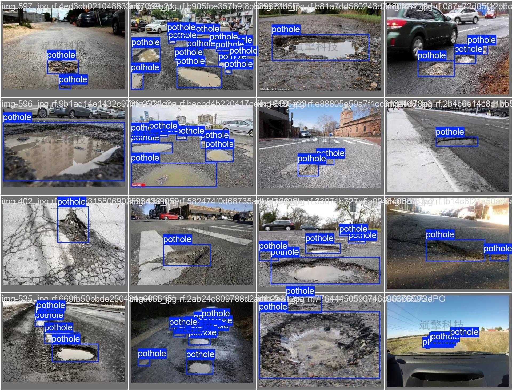
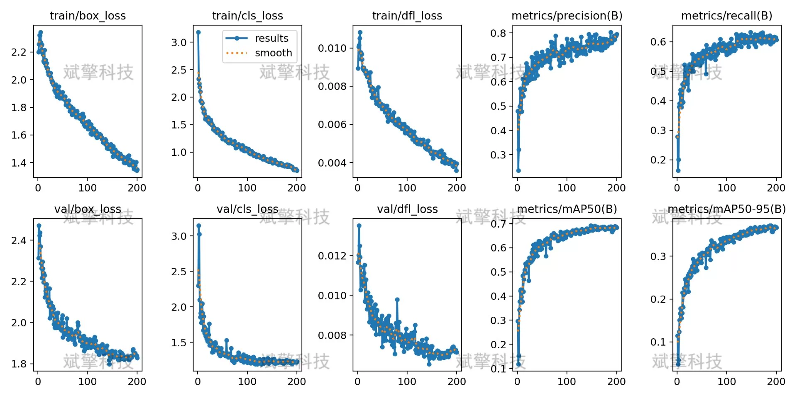
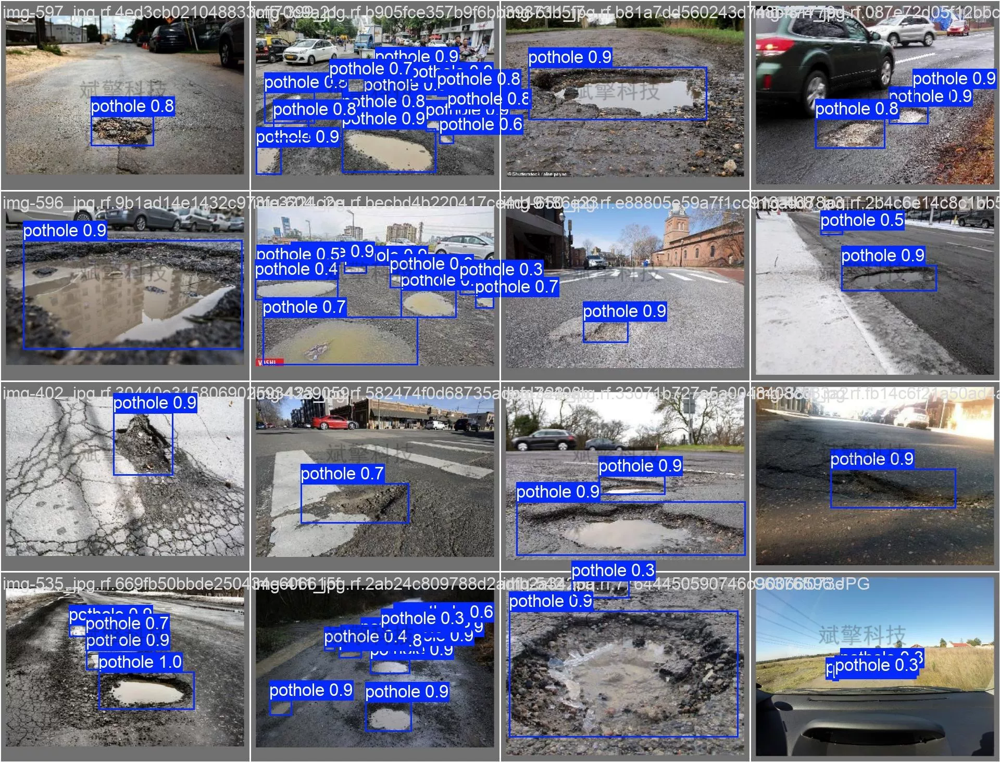
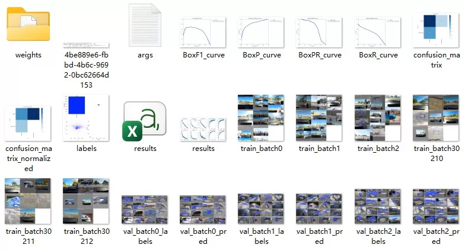
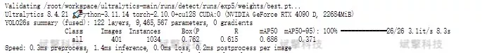
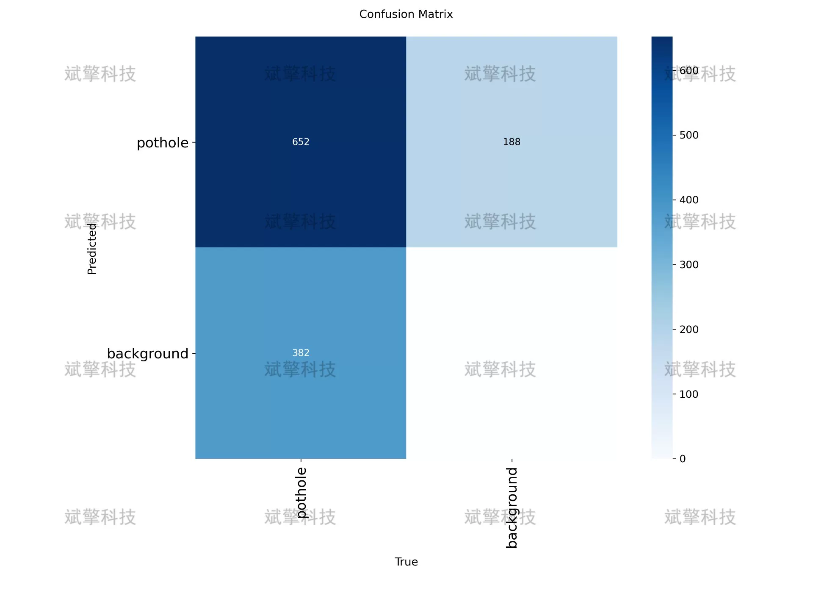
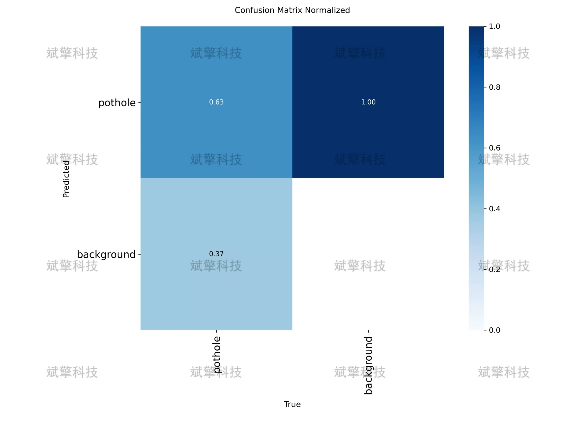

# YOLOv26 Road Ditch Detection System | Source Code + Model

## Body

YOLO26 Road Puddle Detection System | Source Code + Model YOLO26 Real-World: Road Puddle Detection System from Training to Evaluation (Project Source Code + Dataset + Model Weights + UI Interface + Python + Deep Learning + Remote Environment Deployment)

Road puddle detection is a critical task in intelligent transportation systems and road maintenance management. This study builds a single-class detection system for road puddles based on the YOLO26 object detection algorithm. The experiment used 1265 images for training, 401 images for validation, and 118 images for testing. The model achieved an average precision (mAP50) of 68.6% on the validation set, with an accuracy of 76.2% and a recall rate of 61.5%. The confusion matrix analysis showed that the model's accuracy in identifying puddles was 63%. The training process was stable, with the loss function continuously decreasing and no obvious overfitting phenomenon. This study indicates that the YOLO-based road puddle detection system has good potential in practical applications, but there is still room for optimization in small target detection and background interference suppression.

1. Data Set Size
Total image count: 1784
Training set: 1265 (70.9% of total)
Validation set: 401 (22.5% of total)
Test set: 118 (6.6% of total)
The dataset is divided into training set, validation set, and test set at a ratio of approximately 7:2:1 to ensure the reliability of model training, tuning, and final evaluation.

2. Annotation Information
Number of categories: 1 class (pothole)
Total instances: Validation set contains 1034 pothole instances, with an average of about 2.58 potholes per image.

Free reservation for remote installation. Unsuccessful full refund.
Purchase Enjoy the following resources (Baidu Drive automatically unlocked):
   - YOLO Identification Detection Project Complete Source Code
   - YOLO format Dataset
   - Training code + UI interface code
   - Trained model + results image
   - Software installer package
   - Add WeChat reservation for remote installation (Automatically display WeChat ID after purchase) - Unsuccessful, full refund

⚙️ Core Functional Modules
Detection Capability
    Image Detection: Upon upload, returns detection boxes + category information
    Video Detection: Supports video files, analyzes frames accurately
    Camera Real-Time Detection: Connects to USB camera, achieves dynamic monitoring
Interaction and Control
    Target Filtering: Choose one or more categories for detection
    Parameter Real-Time Adjustment: Adjustable confidence threshold & IoU threshold, flexible control of accuracy
    Result Save: One-click save of images/videos/camera detection results
System and Data
    User Login and Registration: Supports password strength checking + encryption storage
    Log Recording: Auto-record operation and error information (with timestamp)

## Images

## Payment

Here is a pay link on Stripe ( https://buy.stripe.com/3cs8yP7sY87d0vu9AB ). Please contact me lonlonago@foxmail.com after funding $89, and I will send you a complete data files , thank you!

